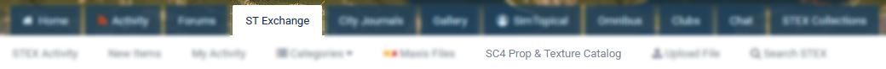

The 4.x versions have once again been built from the ground up, with notable improvements over the 3.x versions including an application and platform independent API, a completely new website, and a significantly expanded database.

This project was inspired by the original [Prop & Texture Photo Catalog](https://sc4devotion.com/forums/index.php?board=415.0) started in 2011, and aims to index all known TGIs and plugin packs for SimCity 4, especially focusing on all known dependencies. This project also builds upon [the Plugin Pack ID Index](https://community.simtropolis.com/forums/topic/75264-plugin-pack-id-indexes/) work includes all known dependency packs to date. This catalog was assembled by [nos.17](https://community.simtropolis.com/profile/455740-nos17/) with assistance from STEX Custodian (Tyberius06), Cyclone Boom, and CorinaMarie.

I aim for this tool to assist many content creators (especially lotters) who are looking for more and better content to incorporate into their work. Looking for a motorcycle to add to your lot? Filter only prop packs that contain vehicles and/or motorcycles. Looking for seasonal trees? Look through all packs that contain seasonal trees until you can find the right ones for you? Want to use all HD? Scour all packs that contain High Definition props to find the ones you want.

## How do I use this?
The easiest way is to use is to visit the website at https://sc4proptexturecatalog.net/.

It can also be accessed directly from the 'ST Exchange' tab at Simtropolis.

It is possible to run the catalog offline with a little bit of know-how, though I do recommend using the web version. Note that at this time, the thumbnails do not work offline as they are all hosted online. 
1. Download or clone this repository.
1. Start up a localhost instance of the website. I use the VS Code extension `ms-vscode.live-server`. Depending on what folder level you open the repository, the site URL may look like `http://127.0.0.1:3000/SC4PropTextureCatalog4/Index.html`
1. Start the API server via NPM. Navigate to `..\SC4PropTextureCatalog\SC4PropTextureCatalogAPI\` in CMD or Powershell and run `npm start app.js`. If this is the first time starting the server, run `npm install` to install the required dependencies. 
1. Press <kbd>Ctrl</kbd>+<kbd>C</kbd> to shut down the server, and simply close the website tab to shut off the live preview.

## I found a problem! / I have a suggestion!
Found a bug? Am I missing a prop or texture pack? Have an idea for additional sorting/filtering categories? Is there a better way to make the Catalog more interactive or useful? I would very much like to hear from you! Visit the [SimCity 4 Prop and Texture Catalog](https://community.simtropolis.com/forums/topic/758501-simcity-4-prop-and-texture-catalogue-by-stex-custodian/) thread or open an issue in Github.
